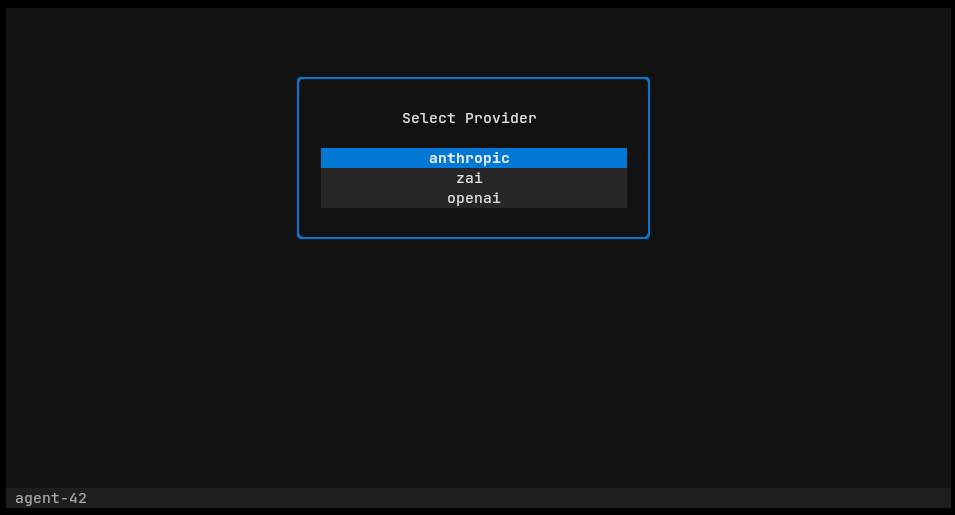
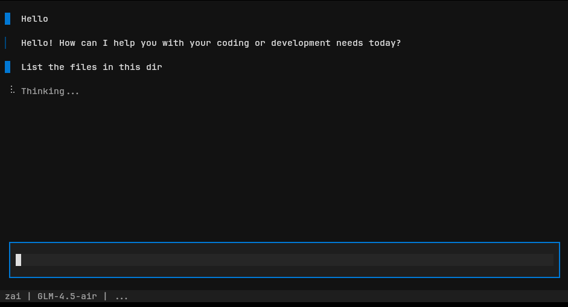
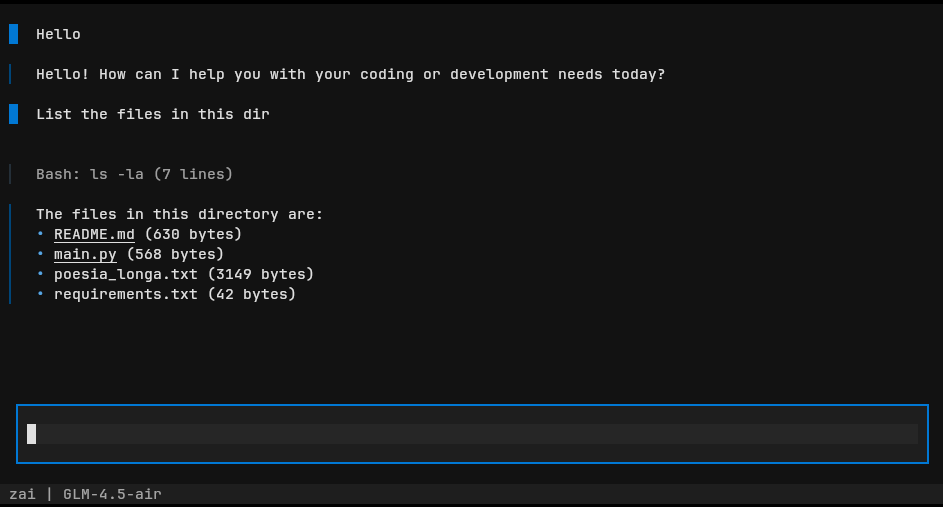
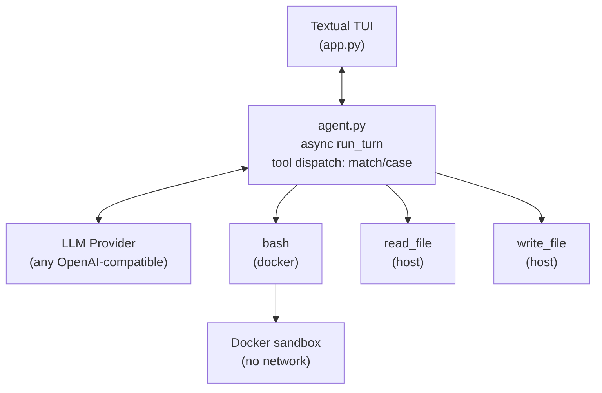

# agent-42

A minimal autonomous coding agent that actually works. No frameworks, no magic — just a `while` loop, tool use, and a rich TUI.

**The entire agent is ~70 lines of logic.** The rest is UI.

<p align="center">
  
</p>

<p align="center">
  
</p>

<p align="center">
  
</p>

## The idea

Most agent frameworks bury the actual mechanism under layers of abstraction — chains, planners, memory modules, orchestrators. agent-42 does the opposite: it exposes the loop.

```python
while True:
    response = llm.stream(messages)

    if response has tool_calls:
        result = execute_tool(tool_call)
        messages.append(tool_result(result))
        continue

    display(response.text)
    messages.append(user_input())
```

The model calls a tool, gets the result, reasons again. That's **interleaved thinking** — and it's all you need for an agent that writes code, runs it, reads files, fixes bugs, and iterates autonomously.

The intelligence is in the model, not in the code.

## Features

- **Rich TUI** — Textual-powered interface with markdown rendering, streaming, collapsible tool widgets, input history
- **Any LLM** — Works with any OpenAI-compatible API (Anthropic, OpenAI, Z.AI, Ollama, etc.)
- **Sandboxed execution** — Shell commands run in Docker with no network access
- **Auto-compaction** — Summarizes conversation when approaching context limits
- **Zero framework lock-in** — LangChain is used only as a provider adapter. Rip it out in 10 minutes.

## Architecture



| File | Role |
|------|------|
| `app.py` | Textual entrypoint — composes TUI, runs agent as async worker |
| `ui.py` | Widgets: ChatView, ChatMessage (streamed markdown), ToolWidget (collapsible), ChatInput (history) |
| `agent.py` | `run_turn()` — the actual agent loop, decoupled from UI via callbacks |
| `tools.py` | Tool definitions (plain dicts) + `execute_tool` dispatch |
| `llm.py` | Provider adapter — sync and async streaming via `ChatOpenAI` |
| `context.py` | Auto-compaction and pruning |
| `config.py` | Provider configuration from `.env` |

## Quickstart

**Requirements:** Python 3.10+, Docker

```bash
git clone https://github.com/JoaoHenriqueBarbosa/agent-42.git
cd agent-42

python -m venv venv
source venv/bin/activate
pip install langchain-openai python-dotenv textual

docker compose up -d

cp .env.example .env
# Add your API keys
```

**Run:**

```bash
python app.py
```

Select a provider with arrow keys, hit Enter, and start coding.

## Providers

Any OpenAI-compatible API works out of the box:

| Provider | Model | Endpoint |
|----------|-------|----------|
| Anthropic | claude-sonnet-4 | `api.anthropic.com/v1/` |
| OpenAI | gpt-4o-mini | `api.openai.com/v1` |
| Z.AI | GLM-4.5-air | `api.z.ai/api/coding/paas/v4` |

Add your own in `config.py`. Any endpoint that speaks the OpenAI chat format works — local models via Ollama, LM Studio, etc.

## Tools

| Tool | What it does |
|------|-------------|
| `bash` | Runs shell commands in an isolated Docker container (no network, 30s timeout) |
| `read_file` | Reads files with line numbers, supports ranges |
| `write_file` | Creates or overwrites files, auto-creates directories |

Tools are plain Python dicts in OpenAI function calling format. No decorators, no abstractions. Dispatch is a `match/case`.

## Design decisions

**Why a while loop?** Because that's what an agent is. The model decides, acts, observes, decides again. Any layer on top of this that doesn't add new capability is dead weight.

**Why LangChain at all?** One reason: `ChatOpenAI` normalizes message formats across providers. If LangChain dies tomorrow, the migration is swapping `.stream()` for HTTP calls. Nothing else changes.

**Why Docker for bash?** The model runs arbitrary shell commands. Docker with `network_mode: none` gives isolation for free. The model doesn't know it's in a container.

**Why Textual?** A coding agent deserves better than `print()`. Markdown rendering, streaming, collapsible tool output, input history — all without leaving the terminal.

## What kind of agent is this?

agent-42 is a **native tool use agent loop** — the practical evolution of [ReAct](https://arxiv.org/abs/2210.03629) (Yao et al., 2022).

ReAct formalized *reason → act → observe → reason again*, but relied on prompting hacks (`Thought:`, `Action:`, `Observation:` tokens). With native tool use APIs, the pattern became infrastructure:

| ReAct concept | Native implementation |
|---|---|
| Thought | Extended thinking / internal reasoning |
| Action | `tool_use` block (typed, structured) |
| Observation | `tool_result` message back to the model |

agent-42 is this loop with zero translation layers. The model speaks directly to the system.

### References

1. **ReAct: Synergizing Reasoning and Acting in Language Models** — Yao et al., 2022. [arXiv:2210.03629](https://arxiv.org/abs/2210.03629)
2. **Toolformer: Language Models Can Teach Themselves to Use Tools** — Schick et al., 2023. [arXiv:2302.04761](https://arxiv.org/abs/2302.04761)
3. **Tool Use** — [Anthropic Docs](https://docs.anthropic.com/en/docs/build-with-claude/tool-use)
4. **Function Calling** — [OpenAI Docs](https://platform.openai.com/docs/guides/function-calling)

## Roadmap

- [x] Context compaction
- [x] Textual TUI with markdown streaming and tool widgets
- [ ] Ctrl+C to cancel running tools
- [ ] Session persistence
- [ ] System prompt refinement

## License

MIT
