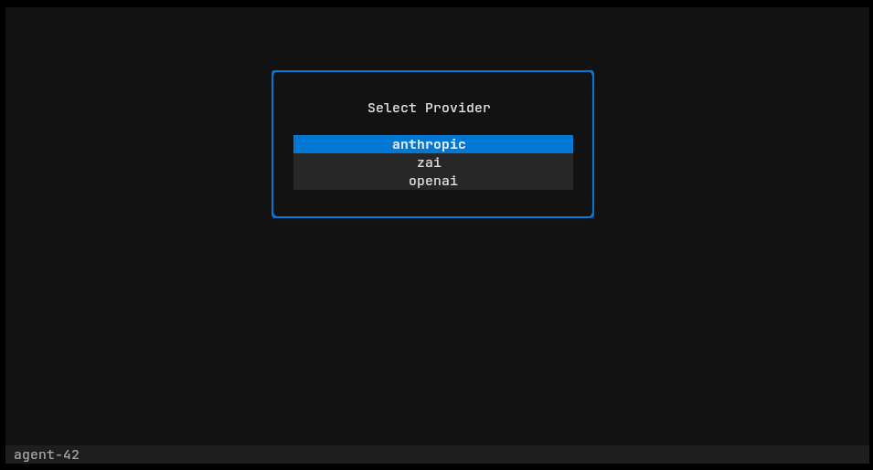
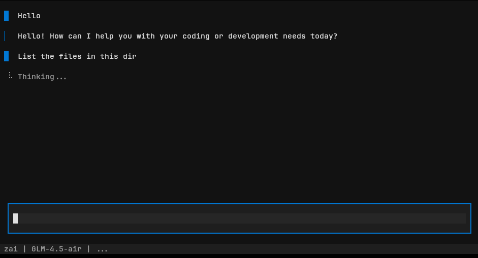
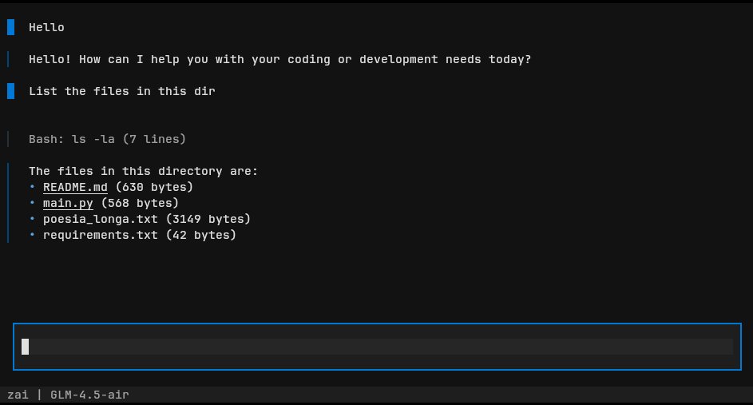
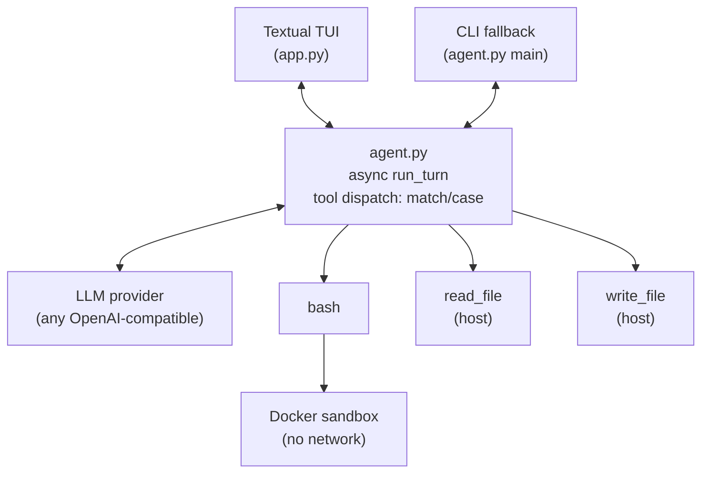

# agent-42

A minimal autonomous coding agent that actually works. No frameworks, no magic — just a `while` loop, tool use, and a rich TUI.

<p align="left">
  
  
  
</p>

The core agent loop is small enough to read in one sitting (roughly ~70 lines of actual logic — the exact count depends on how you slice it). Most of the codebase is the terminal UI: of ~1,000 lines of Python, more than half live in the interface.

<p align="center">
  
</p>

<p align="center">
  
</p>

<p align="center">
  
</p>

> **Status:** agent-42 is an exploratory spike — a deliberately small, single-author project built to expose the bare mechanism of a coding agent, not to be a production tool. It has no test suite and pins no dependency versions (see [Caveats](#caveats)). Read it, learn from it, fork it. Treat it as a teaching artifact, not a supported product.

## The idea

Most agent frameworks bury the actual mechanism under layers of abstraction — chains, planners, memory modules, orchestrators. agent-42 does the opposite: it exposes the loop.

```python
while True:
    response = llm.stream(messages)

    if response has tool_calls:
        result = execute_tool(tool_call)
        messages.append(tool_result(result))
        continue

    display(response.text)
    messages.append(user_input())
```

The model calls a tool, gets the result, reasons again. That's **interleaved thinking** — and it's all you need for an agent that writes code, runs it, reads files, fixes bugs, and iterates autonomously.

The intelligence is in the model, not in the code.

## Highlights

- **One loop, two front-ends** — the same `run_turn` drives both the Textual TUI (`app.py`) and a plain CLI fallback (`python agent.py`). The loop is decoupled from the UI through a dict of callbacks (`on_chunk`, `on_tool_call`, `on_tool_result`, …), so the interface is fully pluggable.
- **Native tool-use loop, no orchestrator** — `run_turn` (in `agent.py`) is the raw `reason → act → observe` pattern with no framework on top. LangChain appears only as a provider adapter in `llm.py`.
- **Three tools, plain dicts** — `bash`, `read_file`, `write_file`, defined as OpenAI function-calling dicts. Dispatch is a single `match/case`. No decorators, no registry.
- **Sandboxed shell** — the `bash` tool runs via `docker exec` in a container started with `network_mode: none`. See [What is and isn't sandboxed](#what-is-and-isnt-sandboxed) for the important caveat about the file tools.
- **Two-level context management** — `prune` clears old tool outputs while protecting recent turns; `compact` summarizes the whole conversation through the LLM when you approach the context limit.
- **Streaming with debounced rendering** — chunks accumulate incrementally, and the TUI re-renders markdown on a debounce (every ~50 ms / ~200 chars) instead of repainting on every token.
- **Multi-provider** — any OpenAI-compatible endpoint. Three providers ship pre-wired (Anthropic, OpenAI, Z.AI); add more in `config.py`.

## Requirements

- **Python 3.10+** — the code uses `match`/`case` and `X | None` type hints.
- **Docker** — required only for the `bash` tool. Without Docker, `read_file` and `write_file` still work; only shell execution breaks.

Dependencies are **not pinned** — there is no `requirements.txt`, `pyproject.toml`, or lockfile. Install the latest of each package (see below) and be aware that a future breaking release of `langchain` or `textual` could require adjustments.

## Quickstart

```bash
git clone https://github.com/JoaoHenriqueBarbosa/agent-42.git
cd agent-42

python -m venv venv
source venv/bin/activate
pip install langchain-openai python-dotenv textual

docker compose up -d          # builds the ubuntu:24.04 sandbox, network disabled

cp .env.example .env
# Fill in your provider keys (see the note below)
```

> **Heads up on `.env`:** despite the "at least one provider is required" comment in `.env.example`, `config.py` currently reads every provider key with `os.environ["..."]` (direct access). If any of the three keys — `ANTHROPIC_API_KEY`, `OPENAI_API_KEY`, `ZAI_API_KEY` — is missing, importing `config.py` raises `KeyError` and the app won't start. Until this is fixed, set **all three** (a placeholder value is enough for providers you don't intend to select).

**Run the TUI:**

```bash
python app.py
```

Select a provider with the arrow keys, hit Enter, and start coding.

**Or the CLI fallback** (no Textual UI, just a `>` prompt):

```bash
python agent.py
```

## Providers

Any OpenAI-compatible API works out of the box:

| Provider  | Default model            | Endpoint                              | Context |
|-----------|--------------------------|---------------------------------------|---------|
| Anthropic | claude-sonnet-4-20250514 | `api.anthropic.com/v1/`               | 200k    |
| OpenAI    | gpt-4o-mini              | `api.openai.com/v1`                   | 128k    |
| Z.AI      | GLM-4.5-air              | `api.z.ai/api/coding/paas/v4`         | 128k    |

Each provider is configured with `<PROVIDER>_API_KEY`, `<PROVIDER>_BASE_URL`, and `<PROVIDER>_MODEL` environment variables. To use a local model (Ollama, LM Studio, …), point one of these providers' `BASE_URL` at your local endpoint, or add a new entry in `config.py` — these aren't pre-configured out of the box.

## Tools

| Tool         | What it does                                                        | Runs in     |
|--------------|--------------------------------------------------------------------|-------------|
| `bash`       | Runs a shell command (working dir `/workspace`, 30s timeout)       | Docker sandbox (no network) |
| `read_file`  | Reads a file with line numbers, optional `start_line`/`end_line`   | **Host**    |
| `write_file` | Creates or overwrites a file, auto-creating parent directories     | **Host**    |

Tools are plain Python dicts in OpenAI function-calling format. No decorators, no abstractions. Dispatch is a `match/case` in `execute_tool`.

## What is and isn't sandboxed

This distinction matters, so it's stated plainly:

- **`bash` is sandboxed.** It executes through `docker exec` inside a container started with `network_mode: none`. Shell commands cannot reach the network and run isolated from the host.
- **`read_file` and `write_file` run on the host.** They operate directly on the host filesystem, rooted at the `workspace/` directory and guarded only by a `_safe_path` prefix check — they do **not** go through the container. The isolation guarantee applies to shell execution, not to file reads and writes.

If you point the agent at a directory you care about, remember it can write to files under the configured workspace on your real machine.

## Architecture


```mermaid
graph TD
    TUI["Textual TUI<br/>(app.py)"] <--> Agent["agent.py<br/>async run_turn<br/>tool dispatch: match/case"]
    CLI["CLI fallback<br/>(agent.py main)"] <--> Agent
    Agent <--> LLM["LLM provider<br/>(any OpenAI-compatible)"]

    Agent --> Bash["bash"]
    Agent --> ReadFile["read_file<br/>(host)"]
    Agent --> WriteFile["write_file<br/>(host)"]

    Bash --> Docker["Docker sandbox<br/>(no network)"]
```

```
agent-42/
├── app.py            # Textual entrypoint — composes TUI, runs agent as async worker
├── agent.py          # run_turn() agent loop (callback-decoupled) + CLI main()
├── ui.py             # Textual widgets: ChatView, ChatMessage, ToolWidget, ChatInput, StatusFooter
├── ui_cli.py         # Plain print/input UI for the CLI mode
├── tools.py          # 3 tool dicts + execute_tool dispatch + tool_bash/read/write
├── context.py        # get_token_count, prune, compact — context management
├── llm.py            # make_llm(provider) with ChatOpenAI + bind_tools; streaming helpers
├── config.py         # Provider configuration from .env
├── prompts.py        # Loads system_prompt.txt / compact_prompt.txt
├── system_prompt.txt # Agent persona and working conventions
├── compact_prompt.txt# Summarization template for auto-compaction
├── styles.tcss       # Textual CSS
├── Dockerfile        # ubuntu:24.04 sandbox image
└── compose.yml       # Brings up the agent-42-sandbox container
```

## Under the hood: context management

The context layer (`context.py`) keeps a long conversation inside the model's window through two mechanisms:

- **`prune`** replaces old tool outputs with `[output cleared]`, preserving roughly the last ~40k tokens and the last two user turns. It only acts when there are enough prunable tokens to be worth it (~20k+).
- **`compact`** kicks in when the conversation overflows (limit minus a ~20k buffer): it asks the LLM to summarize the entire history, then restarts the message list from that summary.

Token counts come from the provider's `usage_metadata` when available, with a heuristic fallback: `estimate_tokens` computes `total_chars // CHARS_PER_TOKEN` (with `CHARS_PER_TOKEN = 4`). That fallback is a plain linear map in one dimension, `f(x) = x / 4` — scaling character count by a constant. Because it's linear, it's *additive*: `f(a + b) = f(a) + f(b)`, which is exactly why the code can sum the character lengths of every message first and divide once at the end, rather than estimating each message separately and adding up. There's no clamping or saturation anywhere in that path, so the linearity holds end to end.

## Design decisions

**Why a while loop?** Because that's what an agent is. The model decides, acts, observes, decides again. Any layer on top of this that doesn't add new capability is dead weight.

**Why LangChain at all?** One reason: `ChatOpenAI` normalizes message formats across providers. If LangChain dies tomorrow, the migration is swapping `.stream()` for HTTP calls. Nothing else changes.

**Why Docker for bash?** The model runs arbitrary shell commands. Docker with `network_mode: none` gives isolation for free. The model doesn't know it's in a container.

**Why Textual?** A coding agent deserves better than `print()`. Markdown rendering, streaming, collapsible tool output, input history — all without leaving the terminal.

## What kind of agent is this?

agent-42 is a **native tool use agent loop** — the practical evolution of [ReAct](https://arxiv.org/abs/2210.03629) (Yao et al., 2022).

ReAct formalized *reason → act → observe → reason again*, but relied on prompting hacks (`Thought:`, `Action:`, `Observation:` tokens). With native tool use APIs, the pattern became infrastructure:

| ReAct concept | Native implementation |
|---|---|
| Thought | Extended thinking / internal reasoning |
| Action | `tool_use` block (typed, structured) |
| Observation | `tool_result` message back to the model |

agent-42 is this loop with zero translation layers. The model speaks directly to the system.

### References

1. **ReAct: Synergizing Reasoning and Acting in Language Models** — Yao et al., 2022. [arXiv:2210.03629](https://arxiv.org/abs/2210.03629)
2. **Toolformer: Language Models Can Teach Themselves to Use Tools** — Schick et al., 2023. [arXiv:2302.04761](https://arxiv.org/abs/2302.04761)
3. **Tool Use** — [Anthropic Docs](https://docs.anthropic.com/en/docs/build-with-claude/tool-use)
4. **Function Calling** — [OpenAI Docs](https://platform.openai.com/docs/guides/function-calling)

## Development

There is **no build step and no test suite** — this is a small, flat, script-style project. To hack on it:

```bash
git clone https://github.com/JoaoHenriqueBarbosa/agent-42.git
cd agent-42
python -m venv venv && source venv/bin/activate
pip install langchain-openai python-dotenv textual
docker compose up -d
python app.py            # or: python agent.py
```

All Python modules live at the repository root; there is no package or subpackage to install. If you add tests, `pytest` is the natural fit — contributions that introduce a test suite are especially welcome (see [CONTRIBUTING.md](CONTRIBUTING.md)).

## Caveats

Called out explicitly, because honesty beats surprise:

- **No tests, no CI.** There is currently zero automated test coverage and no CI pipeline.
- **Unpinned dependencies.** No lockfile or version constraints; a future release of a dependency could break the install.
- **Not a published package.** There's no `pyproject.toml`/`setup.py`; you run it from a clone, not `pip install agent-42`.
- **All three provider keys must be set today** (see the `.env` note above), even though only one provider is used at a time.
- **File tools run on the host** — only `bash` is sandboxed (see [What is and isn't sandboxed](#what-is-and-isnt-sandboxed)).
- **Roadmap items are not done.** Tool cancellation and session persistence (below) are not implemented.

## Roadmap

- [x] Context compaction
- [x] Textual TUI with markdown streaming and tool widgets
- [ ] Ctrl+C to cancel running tools
- [ ] Session persistence
- [ ] Allow a single provider to boot without all keys set
- [ ] System prompt refinement

## Contributing

Contributions are welcome. See [CONTRIBUTING.md](CONTRIBUTING.md) for setup and the PR flow, [CODE_OF_CONDUCT.md](CODE_OF_CONDUCT.md) for community expectations, and [SECURITY.md](SECURITY.md) for reporting vulnerabilities.

## License

Released under the [MIT License](LICENSE).
